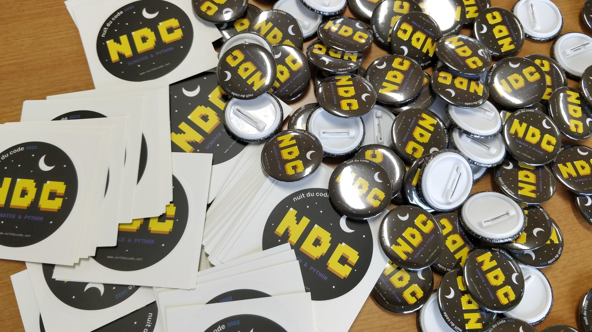
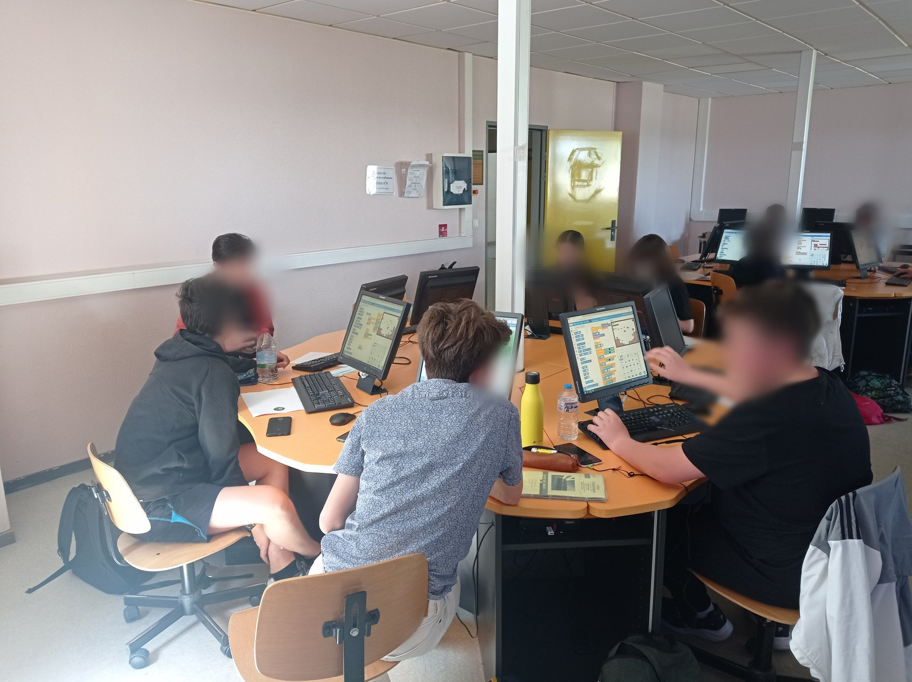
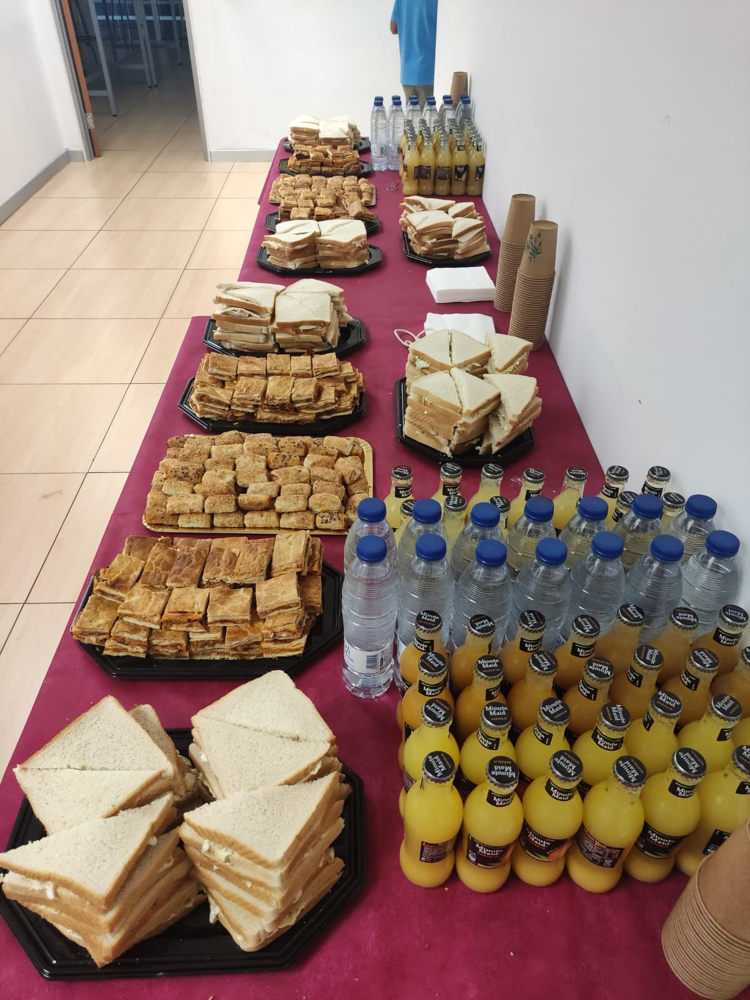
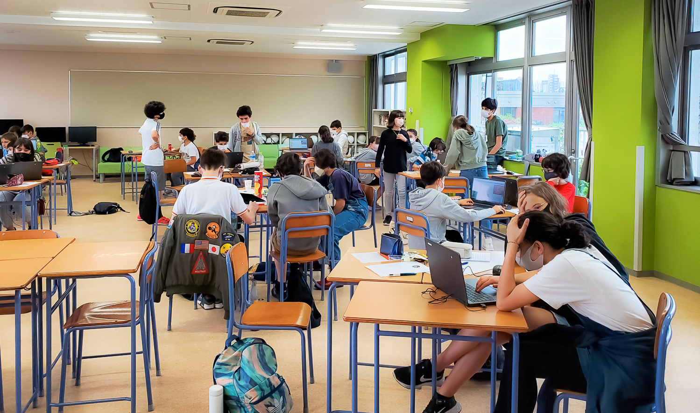
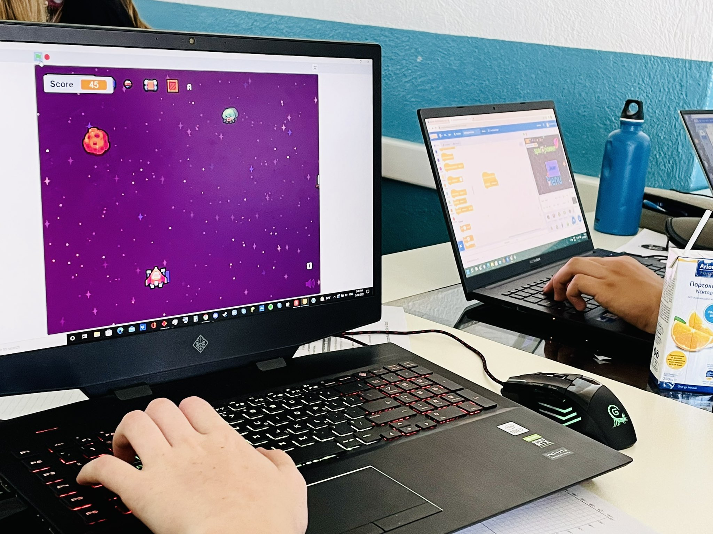

---
hide:
  - footer
---

# PRÉSENTATION

*La <b>Nuit du c0de</b> : créer un jeu avec Scratch ou Python en 6 heures!*

## PRÉSENTATION GÉNÉRALE

La **Nuit du c0de** est un marathon de programmation Scratch et Python organisé par le Lycée Français International de Tokyo. Il s'adresse à tous les établissements scolaires français (cours moyen / collège / lycée) de l'étranger et de France.

Par équipes de deux ou trois réparties en plusieurs catégories (cycle 3, cycle 4 et lycée), les élèves ont six heures (ou moins pour les élèves de cycle 3) pour programmer entièrement un jeu avec Scratch ou Python à partir d'un univers de jeu fourni.

Chaque année, plusieurs univers de jeu sont proposés. Ces univers de jeux sont mis à dispositions des organisateurs 48h avant la date choisie par l'établissement pour organiser la **Nuit du c0de**. Les élèves découvrent ces univers de jeu au début de la **Nuit du c0de** et les équipes doivent en choisir un. Un univers de jeu contient tous les éléments, sons et arrière-plans nécessaires pour créer le jeu.

Pour préparer les élèves durant l'année, des fiches, des tutoriels, des vidéos et des sujets d'entraînement sont fournis. La préparation peut se faire en présence d'enseignants mais elle peut aussi se faire de façon autonome. Les élèves n'ont pas besoin d'avoir des connaissances particulières en Scratch et Python en début d'année pour participer à la **Nuit du c0de**. Quelques séances de préparation et un peu de travail en autonomie suffisent.  

Durant l'événement, les élèves mettront à l'épreuve leur capacité à travailler en groupe, leurs compétences en algorithmique et en mathématiques ainsi que leur créativité (les univers de jeu sont très variés et laissent une grande place à l'imagination et à la construction de scénarios). Pendant la **Nuit du c0de**, les élèves peuvent demander de l'aide aux professeurs qui les encadrent, échanger entre équipes, partager leurs connaissances... Les principaux critères d'évaluation sont la <u>jouabilité</u>, la <u>créativité</u> et l'<u>originalité</u>. 

Le budget nécessaire pour organiser la **Nuit du c0de** au sein d'un établissement peut être quasi nul. Il suffit de quelques ordinateurs connectés à internet (un ou plus par équipe), une ou plusieurs salles et des encadrants. La nourriture et les boissons peuvent être pris en charge par les familles. Mais il est aussi possible, si le budget le permet, de prévoir des pizzas, des gâteaux, des "goodies" (autocollants et badges par exemple), des récompenses...

La **Nuit du c0de** est avant tout un événement festif et convivial.
Chaque établissement peut inscrire autant d'élèves qu'il le souhaite, il n'y a pas de limite sur le nombre de participants. Les inscriptions sont gratuites.

Pour se faire une idée :

* [Vidéos](https://www.nuitducode.net/editions-en-video) des éditions précédentes
* [Univers de jeu](https://scratch.mit.edu/mystuff/#galleries) des éditions précédentes
* [Compte Twitter](https://twitter.com/nuitducode) de la **Nuit du c0de** (informations, images ,vidéos...)

La participation d'un établissement peut être l'occasion de la création d'un atelier de programmation pour les élèves. Les activités de programmation au collège, en mathématiques ou en technologie, peuvent aussi être orientées « jeu » (gestion des déplacements, utilisation de variables pour compter les points...). De même, pour Python, la préparation à la **Nuit du c0de** peut être intégrée aux cours de NSI (boucles, listes, variables, fonctions, programmation orientée objet... ). Les tutoriels proposés pour préparer la **Nuit du c0de** peuvent être modifiés et servir de supports de cours.

{ width="600" }

 

## LES GRANDES LIGNES
* Chaque établissement inscrit autant d'élèves qu'il le souhaite. Il n'y a pas de frais d'inscription.
* Le budget nécessaire peut aller de zéro à quelques centaines d'euros.
* Des ressources, tutoriels et supports, ainsi que des  sujets d'entraînements seront fournis à chaque établissement participant.
* Chaque établissement organise sa **Nuit du c0de** avec ses élèves.
* Au terme de l'épreuve, chaque établissement élit ses équipes championnes qui le représenteront dans chaque catégorie.
* Une sélection mondiale est ensuite établie.

## CALENDRIER
### Septembre 2022 - Avril 2023 : Inscriptions
Si le projet vous intéresse, vous pouvez vous inscrire sur le site [nuitducode.net](https://www.nuitducode.net). Vous aurez alors accès à tous les documents, ressources, tutoriels, supports...  qui vous permettront de préparer et mettre en place la **Nuit du c0de**. Tout est fait pour que la charge de travail des personnes qui organiseront la **Nuit du c0de** dans un établissement soit la plus légère possible.

### Janvier – Mai 2023 : Entraînements / Formation / Sélections
Les établissements inscrits auront accès à de nombreuses ressources : tutoriels, vidéos, guides, espace de discussions... Des univers de jeu avec grilles d'évaluation seront aussi disponibles. Ils pourront être utilisés soit pour organiser des séances d'entraînement avec les élèves, soit comme sujets de sélection (si le nombre d'élèves souhaitant participer est supérieur à la capacité d'accueil de l'établissement). Soit les deux.

### 1er Mai – 27 Mai 2023 : Nuit du c0de
Les établissements inscrits recevront 48h avant la date qu'ils auront fixée pour la **Nuit du c0de**, les univers de jeu qui seront proposés aux élèves. Ces sujets sont confidentiels !

L'épreuve demande un minimum de logistique : ordinateurs en nombre suffisant (d'où la possible nécessité d'organiser des sélections), des encadrants, nourriture et boissons pour les personnes présentes.

Si des regroupements d'établissements proches sont possibles, ils sont encouragés.

### Début juin 2023 : annonce de la sélection "Nuit du c0de 2023"

Huit jeux par catégories seront sélectionnés par un jury d'enseignants. 

 

Pour toute question et demande de précisions, vous pouvez prendre contact avec l'équipe organisatrice à l'adresse <u>contact@nuitducode.net</u>.

 

{ height="200" }
{ height="200" }
{ height="200" }
{ height="200" }

